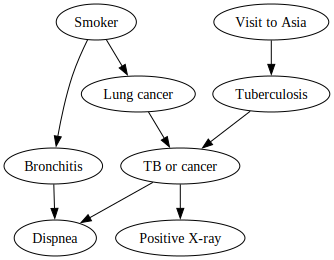

<div align="center">
    <h1>Bayesian networks in Python</h1>
</div>
</br>

This is an unambitious Python library for working with [Bayesian networks](https://www.wikiwand.com/en/Bayesian_network). For serious usage, you should probably be using a more established project, such as [pomegranate](https://pomegranate.readthedocs.io/en/latest/), [pgmpy](http://pgmpy.org/), [bnlearn](https://erdogant.github.io/bnlearn/pages/html/index.html) (which is built on the latter), or even [PyMC](https://docs.pymc.io/). There's also the well-documented [bnlearn](https://www.bnlearn.com/) package in R. Hey, you could even go medieval and use something like [Netica](https://www.norsys.com/) — I'm just jesting, they actually have a [nice tutorial on Bayesian networks](https://www.norsys.com/tutorials/netica/secA/tut_A1.htm). By the way, if you're not familiar with Bayesian networks, then I highly recommend Patrick Winston's MIT courses on probabilistic inference ([part 1](https://www.youtube.com/watch?v=A6Ud6oUCRak), [part 2](https://www.youtube.com/watch?v=EC6bf8JCpDQ)).

The main goal of this project is to be used for educational purposes. As such, more emphasis is put on tidyness and conciseness than on performance. I find libraries such as [pomegranate](https://pomegranate.readthedocs.io/en/latest/) are wonderful. But, they literally contain several thousand lines of non-obvious code, at the detriment of simplicity and ease of comprehension. I've also put some effort into designing a slick API that makes full use of [pandas](https://pandas.pydata.org/). Although performance is not the main focus of this library, it is reasonably efficient and should be able to satisfy most use cases in a timely manner.

## Table of contents

- [Table of contents](#table-of-contents)
- [Installation](#installation)
- [Usage](#usage)
  - [✍️ Manual structures](#️-manual-structures)
  - [🎲 Random sampling](#-random-sampling)
  - [🔮 Probabilistic inference](#-probabilistic-inference)
  - [❓ Missing value imputation](#-missing-value-imputation)
  - [🤷 Likelihood estimation](#-likelihood-estimation)
  - [🧮 Parameter estimation](#-parameter-estimation)
  - [🧱 Structure learning](#-structure-learning)
    - [🌳 Chow-Liu trees](#-chow-liu-trees)
  - [👀 Visualization](#-visualization)
  - [👁️ Graphical user interface](#️-graphical-user-interface)
  - [🔢 Support for continuous variables](#-support-for-continuous-variables)
- [Toy networks](#toy-networks)
- [Development](#development)
- [License](#license)

## Installation

You should be able to install and use this library with any Python version above 3.9:

```sh
pip install git+https://github.com/MaxHalford/sorobn
```

Note that under the hood `sorobn` uses [`vose`](https://github.com/MaxHalford/vose) for random sampling, which is written in Cython.

## Usage

### ✍️ Manual structures

The central construct in `sorobn` is the `BayesNet` class. A Bayesian network's structure can be manually defined by instantiating a `BayesNet`. As an example, let's use [Judea Pearl's famous alarm network](https://books.google.fr/books?id=vFk7DwAAQBAJ&pg=PT40&lpg=PT40&dq=judea+pearl+alarm+network&source=bl&ots=Sa24Dczalo&sig=ACfU3U1yGe85VxGkygAx5G-X6UwYodHpTg&hl=en&sa=X&ved=2ahUKEwjVxJOQvbDpAhUSx4UKHTHPBkwQ6AEwAHoECAoQAQ#v=onepage&q=judea%20pearl%20alarm%20network&f=false):

```python
>>> import sorobn as hh

>>> bn = hh.BayesNet(
...     ('Burglary', 'Alarm'),
...     ('Earthquake', 'Alarm'),
...     ('Alarm', 'John calls'),
...     ('Alarm', 'Mary calls'),
...     seed=42,
... )

```

You may also use the following notation, which is slightly more terse:

```python
>>> import sorobn as hh

>>> bn = hh.BayesNet(
...     (['Burglary', 'Earthquake'], 'Alarm'),
...     ('Alarm', ['John calls', 'Mary calls']),
...     seed=42
... )

```

In Judea Pearl's example, the [conditional probability tables](https://www.wikiwand.com/en/Conditional_probability_table) are given. Therefore, we can define them manually by setting the values of the `P` attribute:

```python
>>> import pandas as pd

# P(Burglary)
>>> bn.P['Burglary'] = pd.Series({False: .999, True: .001})

# P(Earthquake)
>>> bn.P['Earthquake'] = pd.Series({False: .998, True: .002})

# P(Alarm | Burglary, Earthquake)
>>> bn.P['Alarm'] = pd.Series({
...     (True, True, True): .95,
...     (True, True, False): .05,
...
...     (True, False, True): .94,
...     (True, False, False): .06,
...
...     (False, True, True): .29,
...     (False, True, False): .71,
...
...     (False, False, True): .001,
...     (False, False, False): .999
... })

# P(John calls | Alarm)
>>> bn.P['John calls'] = pd.Series({
...     (True, True): .9,
...     (True, False): .1,
...     (False, True): .05,
...     (False, False): .95
... })

# P(Mary calls | Alarm)
>>> bn.P['Mary calls'] = pd.Series({
...     (True, True): .7,
...     (True, False): .3,
...     (False, True): .01,
...     (False, False): .99
... })

```

The `prepare` method has to be called whenever the structure and/or the P are manually specified. This will do some house-keeping and make sure everything is sound. It is not compulsory but highly recommended, just like brushing your teeth.

```python
>>> bn.prepare()

```

Note that you are allowed to specify variables that have no dependencies with any other variable:

```python
>>> _ = hh.BayesNet(
...     ('Cloud', 'Rain'),
...     (['Rain', 'Cold'], 'Snow'),
...     'Wind speed'  # has no dependencies
... )

```

### 🎲 Random sampling

You can use a Bayesian network to generate random samples. The samples will follow the distribution induced by the network's structure and its conditional probability tables.

```python
>>> from pprint import pprint

>>> pprint(bn.sample())
{'Alarm': False,
 'Burglary': False,
 'Earthquake': False,
 'John calls': False,
 'Mary calls': False}

>>> bn.sample(5)  # doctest: +SKIP
    Alarm  Burglary  Earthquake  John calls  Mary calls
0  False     False       False       False       False
1  False     False       False       False       False
2  False     False       False       False       False
3  False     False       False       False       False
4  False     False       False        True       False

```

You can also specify starting values for a subset of the variables.

```python
>>> pprint(bn.sample(init={'Alarm': True, 'Burglary': True}))
{'Alarm': True,
 'Burglary': True,
 'Earthquake': False,
 'John calls': True,
 'Mary calls': False}

```

<!-- There are different sampling methods which you can choose from.

```python
> pprint(bn.sample(method='backward'))
{'Alarm': False,
 'Burglary': False,
 'Earthquake': False,
 'John calls': False,
 'Mary calls': False}

> pprint(bn.sample(init={'Earthquake': True}, method='backward'))
{'Alarm': True,
 'Burglary': False,
 'Earthquake': True,
 'John calls': True,
 'Mary calls': False}

``` -->

The supported inference methods are:

- `forward` for [forward sampling](https://ermongroup.github.io/cs228-notes/inference/sampling/#forward-sampling).
<!--- `backward` for [backward sampling](https://arxiv.org/ftp/arxiv/papers/1302/1302.6807.pdf).-->

Note that randomness is controlled via the `seed` parameter, when `BayesNet` is initialized.

### 🔮 Probabilistic inference

A Bayesian network is a [generative model](https://www.wikiwand.com/en/Generative_model). Therefore, it can be used for many purposes. For instance, it can answer probabilistic queries, such as:

> What is the likelihood of there being a burglary if both John and Mary call?

This question can be answered by using the `query` method, which returns the probability distribution for the possible outcomes. Said otherwise, the `query` method can be used to look at a query variable's distribution conditioned on a given event. This can be denoted as `P(query | event)`.


```python
>>> bn.query('Burglary', event={'Mary calls': True, 'John calls': True})
Burglary
False    0.715828
True     0.284172
Name: P(Burglary), dtype: float64

```

We can also answer questions that involve multiple query variables, for instance:

> What are the chances that John and Mary call if an earthquake happens?

```python
>>> bn.query('John calls', 'Mary calls', event={'Earthquake': True})
John calls  Mary calls
False       False         0.675854
            True          0.027085
True        False         0.113591
            True          0.183470
Name: P(John calls, Mary calls), dtype: float64

```

By default, the answer is found via an exact inference procedure. For small networks this isn't very expensive to perform. However, for larger networks, you might want to prefer using [approximate inference](https://www.wikiwand.com/en/Approximate_inference). The latter is a class of methods that randomly sample the network and return an estimate of the answer. The quality of the estimate increases with the number of iterations that are performed. For instance, you can use [Gibbs sampling](https://www.wikiwand.com/en/Gibbs_sampling):

```python
>>> bn.query(
...     'Burglary',
...     event={'Mary calls': True, 'John calls': True},
...     algorithm='gibbs',
...     n_iterations=1000
... )  # doctest: +SKIP
Burglary
False    0.706
True     0.294
Name: P(Burglary), dtype: float64

```

The supported inference methods are:

- `exact` for [variable elimination](https://www.wikiwand.com/en/Variable_elimination).
- `gibbs` for [Gibbs sampling](https://www.wikiwand.com/en/Gibbs_sampling).
- `likelihood` for [likelihood weighting](https://artint.info/2e/html/ArtInt2e.Ch8.S6.SS4.html).
- `rejection` for [rejection sampling](https://www.wikiwand.com/en/Rejection_sampling).

As with random sampling, randomness is controlled during `BayesNet` initialization, via the `seed` parameter.

### ❓ Missing value imputation

A use case for probabilistic inference is to impute missing values. The `impute` method fills the missing values with the most likely replacements, given the present information. This is usually more accurate than simply replacing by the mean or the most common value. Additionally, such an approach can be much more efficient than [model-based iterative imputation](https://scikit-learn.org/stable/modules/generated/sklearn.impute.IterativeImputer.html#sklearn.impute.IterativeImputer).

```python
>>> sample = {
...     'Alarm': True,
...     'Burglary': True,
...     'Earthquake': False,
...     'John calls': None,  # missing
...     'Mary calls': None   # missing
... }

>>> sample = bn.impute(sample)
>>> pprint(sample)
{'Alarm': True,
 'Burglary': True,
 'Earthquake': False,
 'John calls': True,
 'Mary calls': True}

```

Note that the `impute` method can be seen as the equivalent of [`pomegranate`'s `predict` method](https://pomegranate.readthedocs.io/en/latest/BayesianNetwork.html#prediction).

### 🤷 Likelihood estimation

You can estimate the likelihood of an event with the `predict_proba` method:

```py
>>> event = {
...     'Alarm': False,
...     'Burglary': False,
...     'Earthquake': False,
...     'John calls': False,
...     'Mary calls': False
... }

>>> bn.predict_proba(event)
0.936742...

```

In other words, `predict_proba` computes `P(event)`, whereas the `query` method computes `P(query | event)`. You may also estimate the likelihood for a partial event. The probabilities for the unobserved variables will be summed out.

```py
>>> event = {'Alarm': True, 'Burglary': False}
>>> bn.predict_proba(event)
0.001576...

```

This also works for an event with a single variable:

```py
>>> event = {'Alarm': False}
>>> bn.predict_proba(event)
0.997483...

```

Note that you can also pass a bunch of events to `predict_proba`, as so:

```py
>>> events = pd.DataFrame([
...     {'Alarm': False, 'Burglary': False, 'Earthquake': False,
...      'John calls': False, 'Mary calls': False},
...
...     {'Alarm': False, 'Burglary': False, 'Earthquake': False,
...      'John calls': True, 'Mary calls': False},
...
...     {'Alarm': True, 'Burglary': True, 'Earthquake': True,
...      'John calls': True, 'Mary calls': True}
... ])

>>> bn.predict_proba(events)
Alarm  Burglary  Earthquake  John calls  Mary calls
False  False     False       False       False         0.936743
                             True        False         0.049302
True   True      True        True        True          0.000001
Name: P(Alarm, Burglary, Earthquake, John calls, Mary calls), dtype: float64

```

### 🧮 Parameter estimation

You can determine the values of the P from a dataset. This is a straightforward procedure, as it only requires performing a [`groupby`](https://pandas.pydata.org/pandas-docs/stable/reference/api/pandas.DataFrame.groupby.html) followed by a [`value_counts`](https://pandas.pydata.org/pandas-docs/stable/reference/api/pandas.Series.value_counts.html) for each CPT.

```python
>>> samples = bn.sample(1000)
>>> bn = bn.fit(samples)

```

Note that in this case you do not have to call the `prepare` method because it is done for you implicitly.

If you want to update an already existing Bayesian networks with new observations, then you can use `partial_fit`:

```python
>>> bn = bn.partial_fit(samples[:500])
>>> bn = bn.partial_fit(samples[500:])

```

The same result will be obtained whether you use `fit` once or `partial_fit` multiple times in succession.

### 🧱 Structure learning

#### 🌳 Chow-Liu trees

A Chow-Liu tree is a tree structure that represents a factorised distribution with maximal likelihood. It's essentially the best tree structure that can be found.

```python
>>> samples = hh.examples.asia().sample(300)
>>> structure = hh.structure.chow_liu(samples)
>>> bn = hh.BayesNet(*structure)

```

### 👀 Visualization

You can use the `graphviz` method to obtain a [`graphviz.Digraph`](https://graphviz.readthedocs.io/en/stable/api.html#graphviz.Digraph) representation.

```python
>>> bn = hh.examples.asia()
>>> dot = bn.graphviz()
>>> path = dot.render('asia', directory='figures', format='svg', cleanup=True)

```

</br>
<div align="center">
    
</div>
</br>

Note that the [`graphviz` library](https://graphviz.readthedocs.io/en/stable/) is not installed by default because it requires a platform dependent binary. Therefore, you have to [install it](https://graphviz.readthedocs.io/en/stable/#installation) by yourself.

### 👁️ Graphical user interface

A side-goal of this project is to provide a user interface to play around with a given user interface. Fortunately, we live in wonderful times where many powerful and opensource tools are available. At the moment, I have a preference for [`streamlit`](https://www.streamlit.io/).

You can install the GUI dependencies by running the following command:

```sh
$ pip install git+https://github.com/MaxHalford/sorobn --install-option="--extras-require=gui"
```

You can then launch a demo by running the `sorobn` command:

```sh
$ sorobn
```

This will launch a `streamlit` interface where you can play around with the examples that `sorobn` provides. You can see a running instance of it in [this Streamlit app](https://sorobn.streamlit.app/).

An obvious next step would be to allow users to run this with their own Bayesian networks. Then again, using `streamlit` is so easy that you might as well do this yourself.

### 🔢 Support for continuous variables

Bayesian networks that handle both discrete and continuous are said to be *hybrid*. There are two approaches to deal with continuous variables. The first approach is to use [parametric distributions](https://www.wikiwand.com/en/Parametric_statistics) within nodes that pertain to a continuous variable. This has two disadvantages. First, it is complex because there are different cases to handle: a discrete variable conditioned by a continuous one, a continuous variable conditioned by a discrete one, or combinations of the former with the latter. Secondly, such an approach requires having to pick a parametric distribution for each variable. Although there are methods to automate this choice for you, they are expensive and are far from being foolproof.

The second approach is to simply discretize the continuous variables. Although this might seem naive, it is generally a good enough approach and definitely makes things simpler implementation-wise. There are many ways to go about discretising a continuous attribute. For instance, you can apply a [quantile-based discretization function](https://pandas.pydata.org/pandas-docs/stable/reference/api/pandas.qcut.html). You could also round each number to its closest integer. In some cases you might be able to apply a manual rule. For instance, you can convert a numeric temperature to "cold", "mild", and "hot".

To summarize, we prefer to give the user the flexibility to discretize the variables by herself. Indeed, most of the time the best procedure depends on the problem at hand and cannot be automated adequately.

## Toy networks

Several toy networks are available to fool around with in the `examples` submodule:

- 🚨 `alarm` — the alarm network introduced by Judea Pearl.
- 🐉 `asia` — a popular example introduced in [*Local computations with probabilities on graphical structures and their application to expert systems*](https://www.jstor.org/stable/2345762).
- 🎓 `grades` — an [example](https://ermongroup.github.io/cs228-notes/representation/directed/) from Stanford's CS 228 class.
- 💦 `sprinkler` — the network used in chapter 14 of [*Artificial Intelligence: A Modern Approach (3rd edition)*](https://www.google.com/url?sa=t&rct=j&q=&esrc=s&source=web&cd=2&ved=2ahUKEwj5mv3s9rLpAhU3D2MBHc0zARIQFjABegQIAhAB&url=https%3A%2F%2Ffaculty.psau.edu.sa%2Ffiledownload%2Fdoc-7-pdf-a154ffbcec538a4161a406abf62f5b76-original.pdf&usg=AOvVaw0i7pLrlBs9LMW296xeV6b0).

Here is some example usage:

```python
>>> bn = hh.examples.sprinkler()

>>> bn.nodes
['Cloudy', 'Rain', 'Sprinkler', 'Wet grass']

>>> pprint(bn.parents)
{'Rain': ['Cloudy'],
 'Sprinkler': ['Cloudy'],
 'Wet grass': ['Rain', 'Sprinkler']}

>>> pprint(bn.children)
{'Cloudy': ['Rain', 'Sprinkler'],
 'Rain': ['Wet grass'],
 'Sprinkler': ['Wet grass']}

```

## Development

```sh
# Download and navigate to the source code
git clone https://github.com/MaxHalford/sorobn
cd sorobn

# Install poetry
curl -sSL https://install.python-poetry.org | POETRY_PREVIEW=1 python3 -

# Install in development mode
poetry install

# Run tests
poetry shell
pytest
```

## License

This project is free and open-source software licensed under the [MIT license](https://github.com/MaxHalford/sorobn/blob/master/LICENSE).
