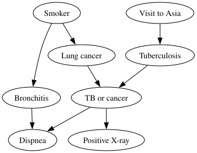

<div align="center">
    <h1>sorobn — Bayesian networks in Python</h1>
    <div>
        <a href="https://github.com/MaxHalford/sorobn/actions/workflows/test.yml"></a>
    </div>
</div>
</br>


This is an unambitious Python library for working with [Bayesian networks](https://www.wikiwand.com/en/Bayesian_network). For serious usage, you should probably be using a more established project, such as [pomegranate](https://pomegranate.readthedocs.io/en/latest/), [pgmpy](http://pgmpy.org/), [bnlearn](https://erdogant.github.io/bnlearn/pages/html/index.html) (which is built on the latter), or even [PyMC](https://docs.pymc.io/). There's also the well-documented [bnlearn](https://www.bnlearn.com/) package in R. Hey, you could even go medieval and use something like [Netica](https://www.norsys.com/) — I'm just jesting, they actually have a [nice tutorial on Bayesian networks](https://www.norsys.com/tutorials/netica/secA/tut_A1.htm). By the way, if you're not familiar with Bayesian networks, then I highly recommend Patrick Winston's MIT courses on probabilistic inference ([part 1](https://www.youtube.com/watch?v=A6Ud6oUCRak), [part 2](https://www.youtube.com/watch?v=EC6bf8JCpDQ)).

The main goal of this project is to be used for educational purposes. As such, more emphasis is put on tidyness and conciseness than on performance. I find libraries such as [pomegranate](https://pomegranate.readthedocs.io/en/latest/) are wonderful. But, they literally contain several thousand lines of non-obvious code, at the detriment of simplicity and ease of comprehension. I've also put some effort into designing a slick API that makes full use of [pandas](https://pandas.pydata.org/). Although performance is not the main focus of this library, it is reasonably efficient and should be able to satisfy most use cases in a timely manner.

## Table of contents

- [Table of contents](#table-of-contents)
- [Installation](#installation)
- [Usage](#usage)
  - [✍️ Manual structures](#️-manual-structures)
  - [🎲 Random sampling](#-random-sampling)
  - [🔮 Probabilistic inference](#-probabilistic-inference)
  - [🔎 Predicates and selectivity estimation](#-predicates-and-selectivity-estimation)
  - [❓ Missing value imputation](#-missing-value-imputation)
  - [🤷 Likelihood estimation](#-likelihood-estimation)
  - [🧮 Parameter estimation](#-parameter-estimation)
  - [🔢 Support for continuous variables](#-support-for-continuous-variables)
  - [🧱 Structure learning](#-structure-learning)
    - [🌳 Chow-Liu trees](#-chow-liu-trees)
  - [👀 Visualization](#-visualization)
  - [👁️ Graphical user interface](#️-graphical-user-interface)
- [Toy networks](#toy-networks)
- [Development](#development)
- [License](#license)

## Installation

You should be able to install and use this library with any Python version above 3.9:

```sh
pip install sorobn
```

Note that under the hood, `sorobn` uses [`vose`](https://github.com/MaxHalford/vose) for random sampling, which is written in Cython.

## Usage

### ✍️ Manual structures

The central construct in `sorobn` is the `BayesNet` class. A Bayesian network's structure can be manually defined by instantiating a `BayesNet`. As an example, let's use [Judea Pearl's famous alarm network](https://books.google.fr/books?id=vFk7DwAAQBAJ&pg=PT40&lpg=PT40&dq=judea+pearl+alarm+network&source=bl&ots=Sa24Dczalo&sig=ACfU3U1yGe85VxGkygAx5G-X6UwYodHpTg&hl=en&sa=X&ved=2ahUKEwjVxJOQvbDpAhUSx4UKHTHPBkwQ6AEwAHoECAoQAQ#v=onepage&q=judea%20pearl%20alarm%20network&f=false):

```python
>>> import sorobn

>>> bn = sorobn.BayesNet(
...     ('Burglary', 'Alarm'),
...     ('Earthquake', 'Alarm'),
...     ('Alarm', 'John calls'),
...     ('Alarm', 'Mary calls'),
...     seed=42,
... )

```

You may also use the following notation, which is slightly more terse:

```python
>>> import sorobn

>>> bn = sorobn.BayesNet(
...     (['Burglary', 'Earthquake'], 'Alarm'),
...     ('Alarm', ['John calls', 'Mary calls']),
...     seed=42
... )

```

In Judea Pearl's example, the [conditional probability tables](https://www.wikiwand.com/en/Conditional_probability_table) are given. Therefore, we can define them manually by setting the values of the `P` attribute. Each CPT is defined as a `pd.DataFrame` where each column is a variable and the `p` column contains the probabilities. The column names make the variable ordering explicit, so there's no ambiguity:

```python
>>> import pandas as pd

# P(Burglary)
>>> bn.P['Burglary'] = pd.Series({False: .999, True: .001})

# P(Earthquake)
>>> bn.P['Earthquake'] = pd.Series({False: .998, True: .002})

# P(Alarm | Burglary, Earthquake)
>>> bn.P['Alarm'] = pd.DataFrame({
...     'Burglary':   [True,  True, True,  True, False, False, False, False],
...     'Earthquake': [True,  True, False, False, True,  True, False, False],
...     'Alarm':      [True, False, True,  False, True, False, True,  False],
...     'p':          [.95,   .05,  .94,   .06,   .29,   .71,  .001,  .999],
... })

# P(John calls | Alarm)
>>> bn.P['John calls'] = pd.DataFrame({
...     'Alarm':      [True, True, False, False],
...     'John calls': [True, False, True, False],
...     'p':          [.9,   .1,   .05,   .95],
... })

# P(Mary calls | Alarm)
>>> bn.P['Mary calls'] = pd.DataFrame({
...     'Alarm':      [True, True, False, False],
...     'Mary calls': [True, False, True, False],
...     'p':          [.7,   .3,   .01,   .99],
... })

```

You can also initialize DataFrames with a list of rows and explicit column names, which some may find more readable:

```python
>>> bn.P['Alarm'] = pd.DataFrame(
...     [
...         [True,  True,  True,  .95],
...         [True,  True,  False, .05],
...         [True,  False, True,  .94],
...         [True,  False, False, .06],
...         [False, True,  True,  .29],
...         [False, True,  False, .71],
...         [False, False, True,  .001],
...         [False, False, False, .999],
...     ],
...     columns=['Burglary', 'Earthquake', 'Alarm', 'p'],
... )

```

The column order in the DataFrame doesn't matter — `prepare()` will reorder them to match the network structure. For root nodes (no parents), a simple `pd.Series` is sufficient.

The `prepare` method has to be called whenever the structure and/or the P are manually specified. This will do some house-keeping and make sure everything is sound. It is not compulsory but highly recommended, just like brushing your teeth.

```python
>>> bn.prepare()

```

Note that you are allowed to specify variables that have no dependencies with any other variable:

```python
>>> _ = sorobn.BayesNet(
...     ('Cloud', 'Rain'),
...     (['Rain', 'Cold'], 'Snow'),
...     'Wind speed'  # has no dependencies
... )

```

### 🎲 Random sampling

You can use a Bayesian network to generate random samples. The samples will follow the distribution induced by the network's structure and its conditional probability tables.

```python
>>> from pprint import pprint

>>> pprint(bn.sample())
Burglary      False
Earthquake    False
Alarm         False
John calls    False
Mary calls    False
dtype: bool

>>> bn.sample(5)  # doctest: +SKIP
    Alarm  Burglary  Earthquake  John calls  Mary calls
0  False     False       False       False       False
1  False     False       False       False       False
2  False     False       False       False       False
3  False     False       False       False       False
4  False     False       False        True       False

```

You can also specify starting values for a subset of the variables.

```python
>>> pprint(bn.sample(init={'Alarm': True, 'Burglary': True}))
Burglary       True
Earthquake    False
Alarm          True
John calls     True
Mary calls     True
dtype: bool

```

<!-- There are different sampling methods which you can choose from.

```python
> pprint(bn.sample(method='backward'))
{'Alarm': False,
 'Burglary': False,
 'Earthquake': False,
 'John calls': False,
 'Mary calls': False}

> pprint(bn.sample(init={'Earthquake': True}, method='backward'))
{'Alarm': True,
 'Burglary': False,
 'Earthquake': True,
 'John calls': True,
 'Mary calls': False}

``` -->

The supported inference methods are:

- `forward` for [forward sampling](https://ermongroup.github.io/cs228-notes/inference/sampling/#forward-sampling).
<!--- `backward` for [backward sampling](https://arxiv.org/ftp/arxiv/papers/1302/1302.6807.pdf).-->

Note that randomness is controlled via the `seed` parameter, when `BayesNet` is initialized.

### 🔮 Probabilistic inference

A Bayesian network is a [generative model](https://www.wikiwand.com/en/Generative_model). Therefore, it can be used for many purposes. For instance, it can answer probabilistic queries, such as:

> What is the likelihood of there being a burglary if both John and Mary call?

The `distribution(*variables, given=...)` method returns the joint probability distribution of the requested variables, conditioned on the supplied evidence: `P(variables | given)`. Omit `given` for an unconditional distribution.


```python
>>> bn.distribution('Burglary', given={'Mary calls': True, 'John calls': True})
Burglary
False    0.715828
True     0.284172
Name: P(Burglary), dtype: float64

```

We can also request a distribution over multiple variables, for instance:

> What are the chances that John and Mary call if an earthquake happens?

```python
>>> bn.distribution('John calls', 'Mary calls', given={'Earthquake': True})
John calls  Mary calls
False       False         0.675854
            True          0.027085
True        False         0.113591
            True          0.183470
Name: P(John calls, Mary calls), dtype: float64

```

By default, the answer is found via an exact inference procedure. For small networks this isn't very expensive to perform. However, for larger networks, you might want to prefer using [approximate inference](https://www.wikiwand.com/en/Approximate_inference). The latter is a class of methods that randomly sample the network and return an estimate of the answer. The quality of the estimate increases with the number of iterations that are performed. For instance, you can use [Gibbs sampling](https://www.wikiwand.com/en/Gibbs_sampling):

```python
>>> bn.distribution(
...     'Burglary',
...     given={'Mary calls': True, 'John calls': True},
...     algorithm='gibbs',
...     n_iterations=1000
... )  # doctest: +SKIP
Burglary
False    0.706
True     0.294
Name: P(Burglary), dtype: float64

```

The supported inference methods are:

- `exact` for [variable elimination](https://www.wikiwand.com/en/Variable_elimination).
- `gibbs` for [Gibbs sampling](https://www.wikiwand.com/en/Gibbs_sampling).
- `likelihood` for [likelihood weighting](https://artint.info/2e/html/ArtInt2e.Ch8.S6.SS4.html).
- `rejection` for [rejection sampling](https://www.wikiwand.com/en/Rejection_sampling).

As with random sampling, randomness is controlled during `BayesNet` initialization, via the `seed` parameter.

### 🔎 Predicates and selectivity estimation

`probability(event, given=...)` returns a scalar probability, whereas `distribution(*variables, given=...)` returns a posterior distribution as a `pd.Series`. Both accept predicates as well as ordinary values:

```python
>>> movies = pd.DataFrame({
...     'title': ['Star Wars', 'Star Trek', 'Alien', None],
...     'year': [1977, 2009, 1979, 2000],
... })
>>> movie_bn = sorobn.BayesNet(('title', 'year')).fit(movies)

# P(title LIKE 'Star%')
>>> movie_bn.probability({'title': sorobn.Like('Star%')})
0.5

# Dictionary entries are combined with AND.
>>> movie_bn.probability({'title': sorobn.Like('Star%'), 'year': sorobn.Ge(2000)})
0.25

# Conditional probability: P(year >= 2000 | title LIKE 'Star%').
>>> movie_bn.probability({'year': sorobn.Ge(2000)}, given={'title': sorobn.Like('Star%')})
0.5

# A posterior distribution over years, restricted by a title predicate.
>>> movie_bn.distribution('year', given={'title': sorobn.Glob('Star*')})
year
1977    0.5
2009    0.5
Name: P(year), dtype: float64

# Convert filter selectivity into an estimated number of rows.
>>> len(movies) * movie_bn.probability({'title': sorobn.Like('Star%')})
2.0

```

| Predicate | Meaning |
| --- | --- |
| `Eq(value)` or an ordinary value | Equality |
| `Ne(value)` | Inequality |
| `Lt(value)`, `Le(value)`, `Gt(value)`, `Ge(value)` | Numeric or ordered comparisons |
| `Between(lower, upper)` | Inclusive range |
| `In(values)` | Membership |
| `Like('Star%')` | SQL LIKE: `%` matches any string, `_` matches one character |
| `Glob('Star*')` | Full-string, case-sensitive glob matching |
| `Regex(r'^Star')` | Python regular-expression search |
| `IsNull()`, `IsNotNull()` | Missing and non-missing values |

Use `&`, `|`, and `~` for AND, OR, and NOT on the **same variable**:

```python
>>> movie_bn.probability({'year': sorobn.Ge(1970) & sorobn.Lt(1980)})
0.5
>>> movie_bn.probability({'title': sorobn.Eq('Alien') | sorobn.Like('Star%')})
0.75
>>> movie_bn.probability({'title': ~sorobn.In(['Alien', 'Star Trek'])})
0.25
>>> movie_bn.probability({'title': sorobn.IsNull()})
0.25

```

### ❓ Missing value imputation

A use case for probabilistic inference is to impute missing values. The `impute` method fills the missing values with the most likely replacements, given the present information. This is usually more accurate than simply replacing by the mean or the most common value. Additionally, such an approach can be much more efficient than [model-based iterative imputation](https://scikit-learn.org/stable/modules/generated/sklearn.impute.IterativeImputer.html#sklearn.impute.IterativeImputer).

```python
>>> sample = {
...     'Alarm': True,
...     'Burglary': True,
...     'Earthquake': False,
...     'John calls': None,  # missing
...     'Mary calls': None   # missing
... }

>>> sample = bn.impute(sample)
>>> pprint(sample)
Alarm          True
Burglary       True
Earthquake    False
John calls     True
Mary calls     True
dtype: bool

```

Note that the `impute` method can be seen as the equivalent of [`pomegranate`'s `predict` method](https://pomegranate.readthedocs.io/en/latest/BayesianNetwork.html#prediction).

### 🤷 Likelihood estimation

You can estimate the likelihood of an event with the `predict_proba` method:

```py
>>> event = {
...     'Alarm': False,
...     'Burglary': False,
...     'Earthquake': False,
...     'John calls': False,
...     'Mary calls': False
... }

>>> bn.predict_proba(event)
np.float64(0.936742...)

```

In other words, `predict_proba` computes `P(event)`, whereas `distribution` computes `P(variables | given)`. You may also estimate the likelihood for a partial event. The probabilities for the unobserved variables will be summed out.

```py
>>> event = {'Alarm': True, 'Burglary': False}
>>> bn.predict_proba(event)
np.float64(0.001576...)

```

This also works for an event with a single variable:

```py
>>> event = {'Alarm': False}
>>> bn.predict_proba(event)
np.float64(0.997483...)

```

Note that you can also pass a bunch of events to `predict_proba`, as so:

```py
>>> events = pd.DataFrame([
...     {'Alarm': False, 'Burglary': False, 'Earthquake': False,
...      'John calls': False, 'Mary calls': False},
...
...     {'Alarm': False, 'Burglary': False, 'Earthquake': False,
...      'John calls': True, 'Mary calls': False},
...
...     {'Alarm': True, 'Burglary': True, 'Earthquake': True,
...      'John calls': True, 'Mary calls': True}
... ])

>>> bn.predict_proba(events)
Alarm  Burglary  Earthquake  John calls  Mary calls
False  False     False       False       False         0.936743
                             True        False         0.049302
True   True      True        True        True          0.000001
Name: P(Alarm, Burglary, Earthquake, John calls, Mary calls), dtype: float64

```

### 🧮 Parameter estimation

You can determine the values of the P from a dataset. This is a straightforward procedure, as it only requires performing a [`groupby`](https://pandas.pydata.org/pandas-docs/stable/reference/api/pandas.DataFrame.groupby.html) followed by a [`value_counts`](https://pandas.pydata.org/pandas-docs/stable/reference/api/pandas.Series.value_counts.html) for each CPT.

```python
>>> samples = bn.sample(1000)
>>> bn = bn.fit(samples)

```

Note that in this case you do not have to call the `prepare` method because it is done for you implicitly.

If you want to update an already existing Bayesian networks with new observations, then you can use `partial_fit`:

```python
>>> bn = bn.partial_fit(samples[:500])
>>> bn = bn.partial_fit(samples[500:])

```

The same result will be obtained whether you use `fit` once or `partial_fit` multiple times in succession.

### 🔢 Support for continuous variables

Continuous variables are supported through discretization. Configure a `Discretizer` per variable, then fit the network on raw data. The network learns ordinary discrete tables over pandas interval categories.

| Configuration | Bin scheme |
| --- | --- |
| `Discretizer(n_bins=10, strategy='uniform')` | Equal-width bins between the observed minimum and maximum |
| `Discretizer(n_bins=10, strategy='quantile')` | Approximately equal-frequency bins (the default) |
| `Discretizer(edges=[0, 10, 50, 100])` | Explicit edges; three bins in this example |

Quantile binning removes duplicate edges, so repeated values can produce fewer than `n_bins` bins. Explicit edges must be finite, strictly increasing, and cover the data. Bins include their left endpoint; the final bin also includes its right endpoint.

```python
>>> from sorobn import Discretizer

>>> measurements = pd.DataFrame({'amount': [0., 5., 10., 20.]})
>>> amount_bn = sorobn.BayesNet(
...     'amount',
...     discretizers={'amount': Discretizer(n_bins=2, strategy='uniform')},
... ).fit(measurements)
>>> amount_bn.discretizers['amount'].edges_.tolist()
[0.0, 10.0, 20.0]

# Transformed columns use pandas' native ordered CategoricalDtype.
>>> binned_amount = amount_bn.discretizers['amount'].transform(measurements['amount'])
>>> binned_amount.cat.ordered
True
>>> binned_amount.cat.categories.tolist()
[Interval(0.0, 10.0, closed='left'), Interval(10.0, 20.0, closed='both')]
>>> binned_amount.cat.codes.tolist()
[0, 0, 1, 1]
>>> amount_bn.distribution('amount')
amount
[0.0, 10.0)     0.5
[10.0, 20.0]    0.5
Name: P(amount), dtype: float64

# The interval covers half of each bin, selecting half the total mass.
>>> amount_bn.probability({'amount': sorobn.Between(5, 15)})
0.5
>>> amount_bn.probability({'amount': sorobn.Lt(5)})
0.25

# Intersect constraints before interpolating, including target and evidence.
>>> amount_bn.probability(
...     {'amount': sorobn.Between(2, 8)}, given={'amount': sorobn.Between(0, 5)}
... )
0.6

```

Range queries assume **uniform density within each bin**, equivalent to linear interpolation of the cumulative distribution. A range cutting through a bin contributes the fraction of its width covered. These fractional weights are applied once per variable during discrete inference. The approximation does not recover variation or dependencies within a bin.

Equality to one continuous value has zero probability under this model, except for a column fitted as a constant point mass. For numeric categories such as years or IDs, leave the variable discrete when equality frequencies matter. Nulls remain separate from numeric bins. Queries outside the fitted range have zero mass there.

Each transformed cell contains a native `pd.Interval` value, exposing its `.left`, `.right`, and `.closed` properties. Pandas stores these intervals once in `.cat.categories` and uses compact integer codes per row. Empty bins remain in the categories; missing values use pandas' missing code `-1`. The ordered categorical dtype supports the final bin's inclusive right edge without changing or rounding any boundary.

`distribution()` returns probabilities indexed by interval categories for discretized targets, and `sample()` returns interval values, with categorical columns when returning a DataFrame. `probability()` interprets predicates in the original numeric units. Supplied discretizers and training data are copied. `fit()` relearns bin boundaries; `partial_fit()` fixes them after the first batch and rejects out-of-range values. Use explicit edges when the domain is known in advance.

### 🧱 Structure learning

#### 🌳 Chow-Liu trees

A Chow-Liu tree is a tree structure that represents a factorised distribution with maximal likelihood. It's essentially the best tree structure that can be found.

```python
>>> samples = sorobn.examples.asia().sample(300)
>>> structure = sorobn.structure.chow_liu(samples)
>>> bn = sorobn.BayesNet(*structure)

```

For continuous columns, discretize a **copy** of the data before learning the structure. Then fit the network on the **original raw data**, passing the same discretization schemes. Here is a complete example:

```python
>>> import pandas as pd
>>> import sorobn

# Keep the observations in their original units.
>>> observations = pd.DataFrame({
...     'amount': [0., 1., 9., 10.],
...     'kind': ['small', 'small', 'large', 'large'],
... })
>>> schemes = {'amount': sorobn.Discretizer(n_bins=2, strategy='quantile')}

# Structure learning operates on discrete states, including interval categories.
>>> binned = observations.copy()
>>> for column, scheme in schemes.items():
...     binned[column] = scheme.fit_transform(observations[column])
>>> edges = sorobn.structure.chow_liu(binned, root='kind')
>>> edges
[('kind', 'amount')]

# Parameter fitting takes RAW data: BayesNet applies the schemes itself.
>>> learned_bn = sorobn.BayesNet(*edges, discretizers=schemes).fit(observations)

# Predicates still use the original numeric units.
>>> learned_bn.probability({'amount': sorobn.Lt(5)}, given={'kind': 'small'})
1.0

```

`chow_liu` only sees discrete data; it does not fit discretizers. `BayesNet.fit` refits copies of the supplied schemes. Using the **same schemes and the same raw training data** produces the same boundaries deterministically. Pass raw observations to `BayesNet.fit`. Already transformed interval categories cannot be discretized again.

To choose fixed boundaries explicitly, use `sorobn.Discretizer(edges=[...])` in `schemes`. The rest of the workflow is unchanged. Columns absent from `schemes` stay discrete. More bins retain more numeric detail but increase the size of the conditional probability tables.


### 👀 Visualization

You can use the `graphviz` method to obtain a [`graphviz.Digraph`](https://graphviz.readthedocs.io/en/stable/api.html#graphviz.Digraph) representation.

```python
>>> bn = sorobn.examples.asia()
>>> dot = bn.graphviz()
>>> path = dot.render('asia', directory='figures', format='svg', cleanup=True)

```

</br>
<div align="center">
    
</div>
</br>

Note that the [`graphviz` library](https://graphviz.readthedocs.io/en/stable/) is not installed by default because it requires a platform dependent binary. Therefore, you have to [install it](https://graphviz.readthedocs.io/en/stable/#installation) by yourself.

### 👁️ Graphical user interface

A side-goal of this project is to provide a user interface to play around with a given user interface. Fortunately, we live in wonderful times where many powerful and opensource tools are available. At the moment, I have a preference for [`streamlit`](https://www.streamlit.io/).

You can install the GUI dependencies by running the following command:

```sh
$ pip install git+https://github.com/MaxHalford/sorobn --install-option="--extras-require=gui"
```

You can then launch a demo by running the `sorobn` command:

```sh
$ sorobn
```

This will launch a `streamlit` interface where you can play around with the examples that `sorobn` provides. You can see a running instance of it in [this Streamlit app](https://sorobn.streamlit.app/).

An obvious next step would be to allow users to run this with their own Bayesian networks. Then again, using `streamlit` is so easy that you might as well do this yourself.

## Toy networks

Several toy networks are available to fool around with in the `examples` submodule:

- 🚨 `alarm` — the alarm network introduced by Judea Pearl.
- 🐉 `asia` — a popular example introduced in [*Local computations with probabilities on graphical structures and their application to expert systems*](https://www.jstor.org/stable/2345762).
- 🎓 `grades` — an [example](https://ermongroup.github.io/cs228-notes/representation/directed/) from Stanford's CS 228 class.
- 💦 `sprinkler` — the network used in chapter 14 of [*Artificial Intelligence: A Modern Approach (3rd edition)*](https://www.google.com/url?sa=t&rct=j&q=&esrc=s&source=web&cd=2&ved=2ahUKEwj5mv3s9rLpAhU3D2MBHc0zARIQFjABegQIAhAB&url=https%3A%2F%2Ffaculty.psau.edu.sa%2Ffiledownload%2Fdoc-7-pdf-a154ffbcec538a4161a406abf62f5b76-original.pdf&usg=AOvVaw0i7pLrlBs9LMW296xeV6b0).

Here is some example usage:

```python
>>> bn = sorobn.examples.sprinkler()

>>> bn.nodes
['Cloudy', 'Rain', 'Sprinkler', 'Wet grass']

>>> pprint(bn.parents)
{'Rain': ['Cloudy'],
 'Sprinkler': ['Cloudy'],
 'Wet grass': ['Rain', 'Sprinkler']}

>>> pprint(bn.children)
{'Cloudy': ['Rain', 'Sprinkler'],
 'Rain': ['Wet grass'],
 'Sprinkler': ['Wet grass']}

```

## Development

```sh
# Download and navigate to the source code
git clone https://github.com/MaxHalford/sorobn
cd sorobn

# Install uv
curl -LsSf https://astral.sh/uv/install.sh | sh

# Install in development mode
uv sync

# Run tests
uv run pytest
```

## License

This project is free and open-source software licensed under the [MIT license](https://github.com/MaxHalford/sorobn/blob/master/LICENSE).
